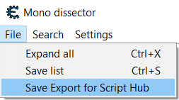

# ScriptHubExport-CE-Addon
 Script that adds an export to JSON functionality for a game's classes and fields in a game.  Intended for use with ScriptHub-AutoOffsets. It was bult for Cheat Engine v7.2 but may work on other versions. Requires some functions from monoscript.lua to work.

## File Descriptions:
- MonoDataCollector.frm is an updated version that includes an Export function on the Dissect Mono window.  
  
- ScriptHubExport.lua contains functions used to export the classes and fields to a json file.

## Instructions:
In cheat engine's program location:
- Copy ScriptHubExport.lua to the autorun directory.
- Replace .\autorun\forms\MonoDataCollector.frm with the included file .\forms\MonoDataCollector.frm
- Run Cheat Engine
- Choose Load Processand and seleect game's .exe.
- Mono->Dissect Mono
- In dissect window: File-> Safe Export for ScriptHub  
- Select a location to save the json (not txt) file. 
- Click Save.
- Wait. Be patient, this process will take several minutes to complete. Cheat engine will be frozen during this time.
- The LUA engine will open with a completion message once it is finished.
